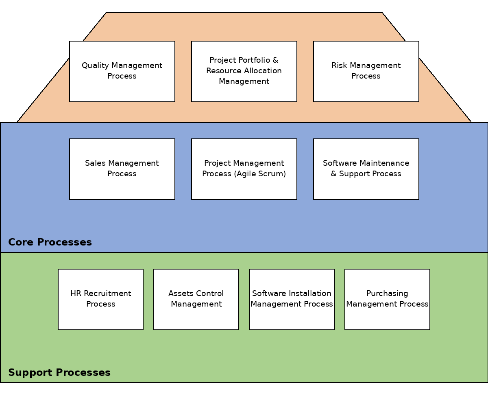

# Danh sách 10 quy trình

Tổng cộng **10 quy trình**, phân theo 3 nhóm: Quản lý (3), Cốt lõi (3), Hỗ trợ (4).

## 1. Quy trình quản lý (Management)

| # | Tên quy trình (EN) | Tên quy trình (VI) |
|---|---|---|
| 1 | Quality Management Process | Quy trình quản lý chất lượng |
| 2 | Project Portfolio & Resource Allocation Management | Quy trình quản lý dự án & phân bổ nguồn lực |
| 3 | Risk Management Process | Quy trình quản lý rủi ro |

## 2. Quy trình cốt lõi (Core)

| # | Tên quy trình (EN) | Tên quy trình (VI) |
|---|---|---|
| 4 | Sales Management Process | Quy trình quản lý bán hàng |
| 5 | Project Management Process | Quy trình quản lý dự án Agile Scrum |
| 6 | Software Maintenance & Support Process | Quy trình bảo trì & hỗ trợ phần mềm |

## 3. Quy trình hỗ trợ (Support)

| # | Tên quy trình (EN) | Tên quy trình (VI) |
|---|---|---|
| 7 | HR Recruitment Process | Quy trình tuyển dụng nhân sự |
| 8 | Asset Control Management | Quy trình quản lý & kiểm soát tài sản |
| 9 | Software Installation Management Process | Quy trình quản lý cài đặt phần mềm |
| 10 | Purchasing Management Process | Quy trình mua hàng |

## Kiến trúc quy trình (Process Architecture)

