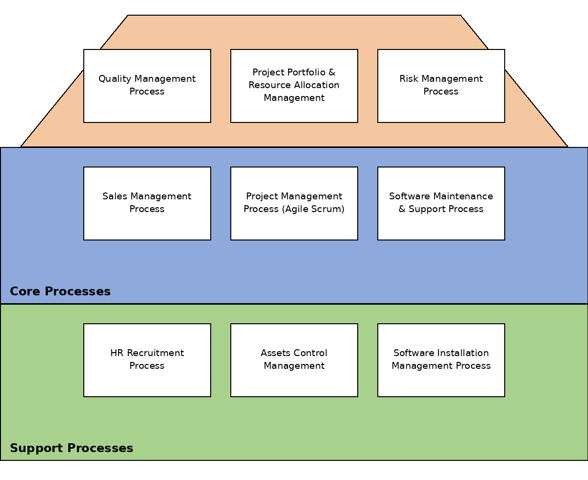

# Danh sách 9 quy trình
## Quy trình quản lý (Management)
- Qualiti Management Process (Quy trình quản lý chất lượng).
- Project Portfolio & Resource Allocation Management (Quy trình quản lý dự án & Phân bỏ nguồn lực).
- Risk Management Process (Quy trình quản lý rủi ro).
## Quy trình cốt lõi (Core)
- Sales Management Process - Quy trình quản lý bán hàng.
- Project Management Process - Quy trình quản lý dự án Agile Scrum.
- Software Maintenance & Support Process - Quy trình bảo trì & hỗ trợ phần mềm
## Quy trình hỗ trợ (Support)
- HR Recruitment Process - Quy trình tuyển dụng nhân sự.
- Asset Control Management - Quy trình quản lý & kiểm soát tài sản.
- Software Installation Management Process - Quy trình quản lý cài đặt phần mềm

## Kiến trúc quy trình (Process Architecture)
