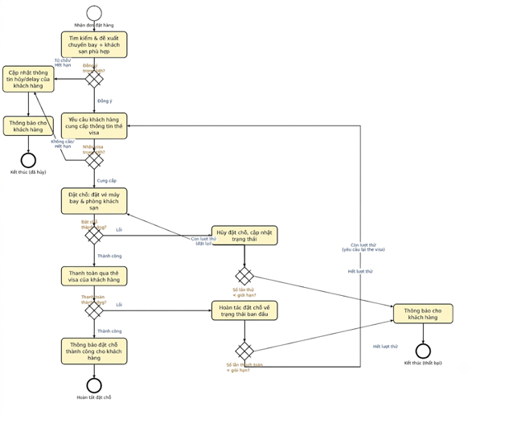

# Đề bài 

Một đại lý du lịch nhận 1 đơn đặt hàng bao gồm vé máy bay và đặt khách sạn từ khách hàng.

Đại lý du lịch sẽ tìm kiếm và lựa chọn phù hợp cả chuyến bay và phòng khách sạn phù hợp với mong muốn khách hàng.

Khách hàng có 24 giờ để lựa chọn hoặc đề xuất đồng ý hoặc từ chối với các phương án đưa ra từ đại lý. Trong trường hợp khách hàng hủy, hoặc mong muốn delay sau đó, thì đại lý thực hiện cập nhật thông tin của khách hàng để ghi nhận lại thông tin hủy của khách hàng và thông báo cho khách hàng biết.

Khi một lựa chọn được thực hiện, khách hàng sẽ được yêu cầu cung cấp thẻ visa. Một lần nữa khách hàng có 24 giờ để cung cấp thông tin này hoặc yêu cầu của khách hàng sẽ được hủy bỏ đồng thời thực hiện thao tác cập nhật như trạng thái trước đó cho trường hợp hủy hoặc delay của khách hàng (thực hiện cập nhật lại thông tin khách hàng và thông báo đến khách hàng biết).

Sau khi nhận được thông tin thẻ visa của khách hàng thì hành động đặt chỗ của khách hàng diễn ra:

- Chuyến bay và phòng khách sạn được đặt thành công. Các biện pháp được thực hiện trong trường hợp đặt chỗ gặp vấn đề, nếu đều này xảy ra trong quá trình đặt chỗ hoặc thanh toán. Khách hàng cung cấp thông tin đến đại lý với thông tin thẻ visa trước khi đặt chỗ hoàn tất. Các thông tin này sẽ được lưu trữ trong hệ thống
- Nếu một lỗi xảy ra trong suốt quá trình đặt chỗ, chuyến bay và đặt phòng của khách hàng sẽ được hủy bỏ và thông tin trạng thái của khách hàng sẽ được cập nhật. Quá trình đặt chỗ của khách hàng sẽ được thực hiện lại trường trường hợp số lần đặt chỗ không vượt quá giới hạn (về số lần và thời gian).
- Khi đặt chỗ khách hàng thành công thì tiền sẽ được thanh toán trên thẻ visa của khách hàng và quá trình sẽ dừng theo sau thông báo đến việc đặt chỗ thành công của khách hàng. Nếu mỗi lỗi xảy ra trong quá trình đặt chuyến bay và đặt phòng thông tin đặt chỗ của khách hàng sẽ được hoàn lại trạng thái ban đầu. Khách hàng sẽ được yêu cầu thực hiện lại cung cấp thông tin thẻ visa và đặt chỗ của khách hàng nếu quá trình thanh toán của khách hàng chưa vượt quá số lần cho phép.

Cả 2 trường hợp, sau khi có lỗi phát sinh, và số lần giới hạn bị vượt qua, khách hàng sẽ được thông báo và dừng quá trình đặt chỗ của khách hàng.

# Mô hình hóa quy trình

