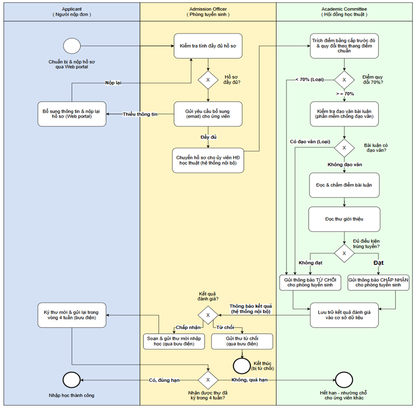

## Đề bài

Là một nhà phân tích quy trình làm việc cho Đại học Newtown, bạn được Mark Johnson – chủ sở hữu quy trình tuyển sinh sinh viên – đề xuất tham gia dự án cải thiện quy trình này. Để mô hình hóa quy trình hiện tại, bạn bắt đầu bằng cách thu thập thông tin liên quan, bao gồm: 
**1. Sơ đồ tổ chức của Văn phòng Phó Hiệu trưởng phụ trách Công tác Sinh viên (nơi nhóm của Mark làm việc),** 
**2. Sơ đồ lớp UML của hệ thống tuyển sinh sinh viên hỗ trợ quy trình, và bộ chính sách tổ chức liên quan trích từ trang web trường.** 
Dựa trên các tài liệu này, hãy: 
**(1) Xây dựng các giả thuyết ban đầu về cách thức hoạt động của quy trình nhập học;**
**(2) Xác định các chuyên gia liên quan cần phỏng vấn.**

# Sơ đồ PBMN quy trình xét tuyển sinh viên Đại học Newtown (tổng hợp từ phỏng vấn)

# Giả thuyết ban đầu về quy trình

Từ sơ đồ tổ chức, sơ đồ lớp UML và chính sách tuyển sinh, có thể suy ra các actor và luồng xử lý giả định ban đầu như sau:

**1. Các actor liên quan (theo sơ đồ tổ chức)**
- Student Admission Office (Phòng tuyển sinh sinh viên): Head – Mark Johnson; Officers – Mary Adams, Moe Ouyang, Louise Smith, Christopher Kidd.
- Enrollment Office (Phòng ghi danh): cùng thuộc bộ phận Admissions & Enrollment nhưng vai trò trong quy trình này chưa rõ ràng, cần xác minh.
- Academic Committee (Hội đồng học thuật): Director – Liza Stewart; Members – Michael Boil, Jan Gable, Terry Tate, Mary Lewis, John Moss, Peter Capello.
- Applicant (Người nộp đơn xin nhập học): actor bên ngoài, tương tác qua hệ thống/Web portal (lớp Visitor/Applicant trong UML).

**2. Giả thuyết về một quy trình gồm 4 giai đoạn cốt lõi kèm theo các nghi vấn cần kiểm chứng (dựa trên sơ đồ lớp UML và chính sách)**

- **Giai đoạn 1:** **Tiếp nhận và Tư vấn thông tin (Information & Visit Request)**
	- Khách tham quan (Visitor) gửi yêu cầu qua Web portal/trực tiếp. Chuyên viên tuyển sinh (Admission Officer) thực hiện nghiệp vụ ProvideInfo()/RequestVisit().
- **Giai đoạn 2: Nộp và Kiểm tra hồ sơ (Application Submission & Verification)**
	- Ứng viên (Applicant) hoàn thiện hồ sơ (Application gồm học vấn, bảng điểm, thư giới thiệu, bài luận) và đóng lệ phí (PayFee()).
	- Admission Officer tiến hành CheckApplication(). Nếu hồ sơ thiếu hoặc có sai sót, họ sẽ tiến hành RequestClarification() để yêu cầu ứng viên bổ sung.
	- Vấn đề cần xác minh: Tần suất bổ sung hồ sơ tối đa là bao nhiêu lần? Có deadline riêng cho việc bổ sung không? Enrollment Office có tham gia lọc sơ bộ ở bước này không?
- **Giai đoạn 3: Đánh giá và Xét tuyển (Assessment & Decision)**
	- Hồ sơ hợp lệ được chuyển đến Hội đồng học thuật (Academic Committee). Quan hệ (2..3) trong UML chỉ ra rằng mỗi hồ sơ sẽ do 2 đến 3 thành viên hội đồng cùng chấm độc lập (AssessApplication()).
	- Kết quả chấm phải thỏa mãn đồng thời 4 tiêu chí cứng trong chính sách: ngành học phù hợp, không đạo văn, điểm số >= 70/100, 2 thư giới thiệu đạt yêu cầu.
	- Hội đồng ra quyết định cuối cùng thông qua AcceptApplication() hoặc RejectApplication().
	- Vấn đề cần xác minh: Việc phân phối hồ sơ cho 2-3 thành viên được thực hiện tự động hay thủ công? Khi 2-3 thành viên có ý kiến trái ngược nhau thì cơ chế phân xử/đồng thuận diễn ra như thế nào?
- **Giai đoạn 4: Ghi danh và Nhập học (Enrollment & Registration)**
	- Ứng viên trúng tuyển có 4 tuần để xác nhận thư mời. Sau khi xác nhận, họ trở thành Sinh viên (Student), được hệ thống cấp quyền đăng ký lớp học (RegisterClasses()) và nhận tư vấn từ Cố vấn học tập (Advisor).
	- Vấn đề cần xác minh (Trọng tâm): Vai trò của Enrollment Office ở đâu? Họ chỉ tiếp nhận sinh viên sau khi đã trúng tuyển (giai đoạn 4), hay họ có tham gia hỗ trợ Admission Office lọc hồ sơ ở giai đoạn 2? Điều gì xảy ra nếu ứng viên không phản hồi sau 4 tuần?

# Xác định chuyên gia cần phỏng vấn

**Nhóm chủ sở hữu quy trình (Process Owners):**
- Mr. Mark Johnson (Head of Student Admission Office): Phỏng vấn để xác định rõ ranh giới (Scope) của quy trình, các chỉ số hiệu suất (KPIs) hiện tại và mối quan hệ phối hợp liên phòng ban.
- Ms. Liza Stewart (Director of Academic Committee): Phỏng vấn để làm rõ quy trình phê duyệt, cơ chế đồng thuận của hội đồng khi đánh giá hồ sơ và cách lưu trữ bảng điểm (ArchiveAssessment()).
- Mr. George Lossing (Head of Enrollment Office): Phỏng vấn để làm rõ điểm chạm giữa phòng Ghi danh và phòng Tuyển sinh, xác minh xem phòng Ghi danh có tham gia vào bất kỳ bước nào trong quá trình xét tuyển hay không.
**Nhóm thực thi trực tiếp (Process Participants):**
- Các chuyên viên tuyển sinh (Mary Adams, Moe Ouyang, Louise Smith, Christopher Kidd): Phỏng vấn sâu để nắm bắt các thao tác thực tế khi kiểm tra hồ sơ, các lỗi phổ biến của ứng viên và cách họ quản lý các hồ sơ cần làm rõ (RequestClarification()).
- Các thành viên hội đồng học thuật (Michael Boil, Jan Gable, Terry Tate, v.v.): Phỏng vấn để hiểu cách họ tiếp nhận, chấm điểm bài luận và phối hợp nhóm (2-3 người) trên cùng một hồ sơ.
- Các cố vấn/nhân viên ghi danh (Joseph Devlin, David Taylor, Ryan Zhu): Phỏng vấn về thủ tục tiếp nhận sinh viên mới và quy trình đăng ký môn học để đảm bảo sự chuyển giao mượt mà giữa hai giai đoạn.
**Nhóm hỗ trợ kỹ thuật/hệ thống (System/IT Support):**
- Quản trị viên hệ thống tuyển sinh (System Administrator): Phỏng vấn để tìm hiểu về kiến trúc luồng dữ liệu của Web portal, các trạng thái tự động của hồ sơ (Status), và các hạn chế về mặt công nghệ hiện tại đang cản trở quy trình.
