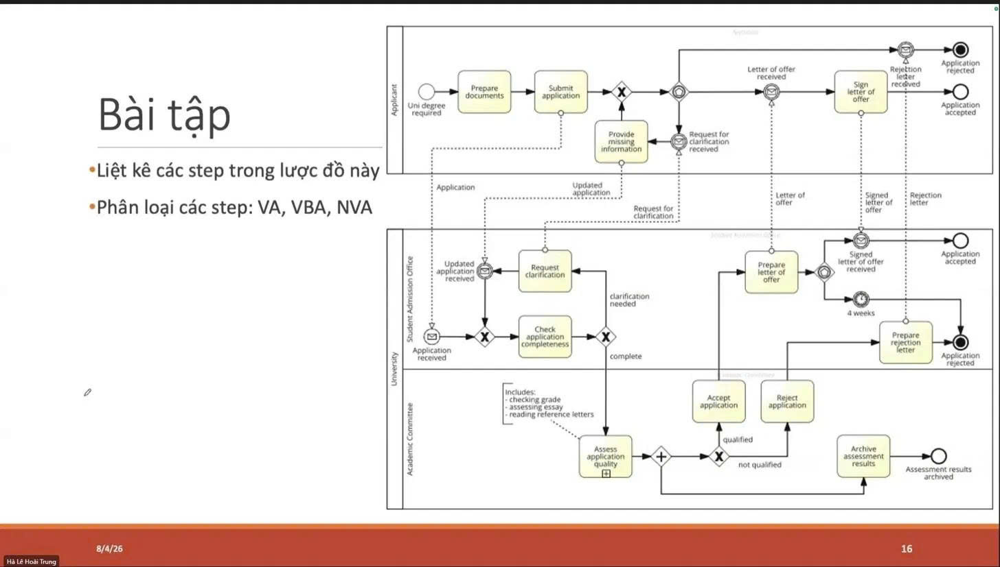

# Đề bài

# Liệt kê các step trong lược đồ

| #   | Step                           | Bộ phận thực hiện        |
| --- | ------------------------------ | ------------------------ |
| 1   | Prepare documents              | Applicant                |
| 2   | Submit application             | Applicant                |
| 3   | Check application completeness | Student Admission Office |
| 4   | Request clarification          | Student Admission Office |
| 5   | Provide missing information    | Applicant                |
| 6   | Assess application quality     | Academic Committee       |
| 7   | Accept application             | Academic Committee       |
| 8   | Reject application             | Academic Committee       |
| 9   | Archive assessment results     | Academic Committee       |
| 10  | Prepare letter of offer        | Student Admission Office |
| 11  | Prepare rejection letter       | Student Admission Office |
| 12  | Sign letter of offer           | Applicant                |

# Phân loại các step: VA / VBA / NVA

Phân loại theo góc nhìn của **Applicant** (khách hàng cuối của quy trình):

- **VA (Value Added)**: tạo giá trị trực tiếp cho khách hàng
- **VBA (Business Value Added)**: cần thiết cho doanh nghiệp/quy định nhưng không tạo giá trị trực tiếp cho khách hàng
- **NVA (Non-Value Added)**: lãng phí, không cần thiết, có thể loại bỏ/cải tiến

| #   | Step                           | Phân loại | Lý do                                                                                                                     |
| --- | ------------------------------ | --------- | ------------------------------------------------------------------------------------------------------------------------- |
| 1   | Prepare documents              | **VA**    | Tạo ra input cần thiết để hồ sơ có thể được xử lý, phục vụ trực tiếp mục tiêu của applicant                               |
| 2   | Submit application             | **VBA**   | Thao tác hành chính bắt buộc để đưa hồ sơ vào hệ thống, không tự nó tạo giá trị                                           |
| 3   | Check application completeness | **VBA**   | Bước kiểm soát cần thiết để đảm bảo hồ sơ hợp lệ, không tạo giá trị cho applicant nhưng bắt buộc                          |
| 4   | Request clarification          | **NVA**   | Phát sinh do hồ sơ thiếu sót/không đầy đủ → đây là rework, lẽ ra không cần nếu hồ sơ nộp đủ ngay từ đầu                   |
| 5   | Provide missing information    | **NVA**   | Cũng là rework – lặp lại công việc do thiếu sót ban đầu                                                                   |
| 6   | Assess application quality     | **VA**    | Bước đánh giá cốt lõi, trực tiếp quyết định kết quả mà applicant quan tâm nhất                                            |
| 7   | Accept application             | **VA**    | Quyết định trực tiếp tạo ra giá trị (kết quả mong muốn) cho applicant                                                     |
| 8   | Reject application             | **VBA**   | Là quyết định cần thiết của quy trình, nhưng không tạo giá trị tích cực cho applicant                                     |
| 9   | Archive assessment results     | **NVA**   | Việc lưu trữ nội bộ, không ảnh hưởng đến giá trị nhận được bởi applicant (có thể là VBA nếu có yêu cầu pháp lý/kiểm toán) |
| 10  | Prepare letter of offer        | **VA**    | Tạo ra output cụ thể mà applicant mong muốn (thư mời nhập học)                                                            |
| 11  | Prepare rejection letter       | **VBA**   | Cần thiết để hoàn tất quy trình và thông báo cho applicant, nhưng không phải giá trị mà applicant mong muốn               |
| 12  | Sign letter of offer           | **VA**    | Hoàn tất mục tiêu cuối cùng của cả quy trình (chấp nhận offer)                                                            |
