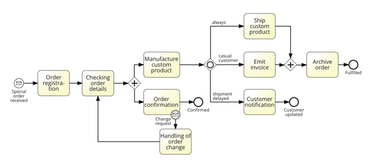

# Đề bài

Xét mô hình quy trình xử lý đơn hàng đặc biệt (special order) trong hình vẽ đề bài, với mô tả như sau: Khi một đơn hàng đặc biệt được tiếp nhận, đơn hàng được đăng ký trước, sau đó chi tiết đơn hàng được kiểm tra. Tiếp theo, đơn hàng được xác nhận, đồng thời sản phẩm tùy chỉnh được sản xuất. Sau khi sản phẩm được sản xuất xong, việc giao hàng có thể được lên kế hoạch. Sau đó, loại khách hàng và tình trạng giao hàng được kiểm tra. Nếu khách hàng là khách vãng lai (casual), một hóa đơn riêng lẻ (ad hoc invoice) phải được phát hành, điều này không bắt buộc với khách hàng thường (ordinary); trong trường hợp khách hàng thường, tài khoản của khách hàng đơn giản được ghi nợ với chi phí liên quan đến việc thực hiện đơn hàng. Ngoài ra, nếu việc giao hàng bị trễ, khách hàng phải được thông báo về thời gian trễ dự kiến. Song song với các hoạt động này, sản phẩm tùy chỉnh được giao đi. Sau hoạt động giao hàng và sau khi hóa đơn được phát hành, quy trình kết thúc bằng việc lưu trữ đơn hàng. Bất cứ lúc nào trong giai đoạn xác nhận đơn hàng và sản xuất sản phẩm tương ứng, một yêu cầu thay đổi đơn hàng có thể được nhận, trong trường hợp đó mọi hoạt động phải bị gián đoạn để xử lý yêu cầu thay đổi. Việc này bao gồm đăng ký lại biến động của đơn hàng và thông báo cho khách hàng, sau đó quy trình tiếp tục lại từ bước kiểm tra đơn hàng.

# Trả lời câu hỏi

## Câu hỏi 1: Mô hình có hợp lệ (valid) và đầy đủ (complete) không?

Mô hình trong hình vẽ KHÔNG hợp lệ và KHÔNG đầy đủ. Cụ thể có 4 vấn đề chính:

**a) Lỗi deadlock ở cổng AND-join (không hợp lệ)**
Sau hoạt động "Manufacture custom product", luồng đi qua một cổng OR-split (inclusive gateway) với 3 nhánh điều kiện: "always" (luôn thực hiện – Ship custom product), "casual customer" (Emit invoice), và "shipment delayed" (Customer notification). Hai nhánh "always" và "casual customer" hội tụ tại một cổng AND-join (parallel gateway) trước khi đến "Archive order".
Lỗi deadlock xảy ra tại cổng AND-Join vì cổng này luôn yêu cầu nhận đủ token từ CẢ hai nhánh đầu vào mới được kích hoạt, trong khi nhánh "Emit invoice" chỉ có token khi khách hàng là khách vãng lai. Nếu khách hàng là khách hàng thường (ordinary), nhánh này sẽ không bao giờ có token, khiến AND-join chờ mãi mãi và đơn hàng của khách hàng thường sẽ không bao giờ được lưu trữ (archive) — đây là lỗi deadlock cấu trúc kinh điển khi ghép một OR-split không đối xứng với một AND-join.

**b) Thiếu hoạt động "ghi nợ tài khoản khách hàng" (không đầy đủ)**
Theo mô tả, đối với khách hàng thường (không phải khách vãng lai), "tài khoản của khách hàng đơn giản được ghi nợ với chi phí liên quan đến việc thực hiện đơn hàng" — đây là một hoạt động bắt buộc phải có trong quy trình, tương đương/thay thế cho "Emit invoice" ở nhánh khách vãng lai. Tuy nhiên, hoạt động này hoàn toàn không xuất hiện trong mô hình.

**c) Thiếu đồng bộ hóa và nguy cơ kết thúc không đúng (không hợp lệ & không đầy đủ)**
Nhánh "Shipment delayed" chuyển sang hoạt động "Customer notification" và kết thúc tại một End Event riêng ("Customer updated"), thay vì hội tụ trở lại luồng chính để tiếp tục đến hoạt động "Archive order". Thiết kế này dẫn đến hai vấn đề:

- Thứ nhất, trong trường hợp giao hàng bị trễ, đơn hàng có thể không được lưu trữ, không phù hợp với yêu cầu của quy trình là mọi đơn hàng đều phải được lưu trữ sau khi hoàn tất giao hàng và phát hành hóa đơn.
- Thứ hai, do sử dụng OR-Split Gateway, nhiều nhánh có thể được kích hoạt đồng thời (ví dụ: vừa xảy ra giao hàng trễ, vừa là khách hàng vãng lai). Khi các nhánh này kết thúc tại các End Event khác nhau mà không được đồng bộ lại, một thể hiện của quy trình có thể kích hoạt nhiều sự kiện kết thúc. Đây là một lỗi ngữ nghĩa trong mô hình BPMN, thường được gọi là improper completion, làm cho quy trình kết thúc không nhất quán.

**d) Phạm vi sự kiện gián đoạn (interrupting event) chưa đầy đủ**
Theo mô tả, yêu cầu thay đổi đơn hàng (change request) có thể xảy ra bất cứ lúc nào trong CẢ hai giai đoạn "xác nhận đơn hàng" (Order confirmation) VÀ "sản xuất sản phẩm" (Manufacture custom product) đang diễn ra song song. Tuy nhiên, trong mô hình, sự kiện biên gián đoạn (boundary event) "Change request" chỉ được gắn vào task "Order confirmation", mà không có sự kiện tương tự gắn vào "Manufacture custom product". Do đó mô hình chưa đầy đủ: cần bổ sung một boundary event tương tự trên "Manufacture custom product" (hoặc gộp cả hai hoạt động vào một sub-process rồi gắn boundary event lên sub-process đó).

**Kết luận:** mô hình vừa không hợp lệ (do lỗi deadlock cấu trúc ở cổng AND-join), vừa không đầy đủ (do thiếu hoạt động ghi nợ tài khoản khách hàng, thiếu đồng bộ nhánh giao hàng trễ với điểm lưu trữ đơn hàng, và thiếu boundary event cho hoạt động sản xuất).

## Câu hỏi 2: Mô hình có chất lượng thực dụng (pragmatic quality) tốt không?

Pragmatic quality phản ánh mức độ mô hình phục vụ tốt mục đích sử dụng đối với người đọc (dễ hiểu, dễ giao tiếp, dễ bảo trì) — khác với syntactic quality (đúng cú pháp ký hiệu) hay semantic quality (đúng với nghiệp vụ thực tế, đã phân tích ở câu 1). Mô hình hiện tại **chưa đạt chất lượng thực dụng tốt**, vì các lý do sau:

1. Đặt tên hoạt động (activity label) chưa nhất quán: một số nhãn ở dạng danh động từ/danh từ ghép ("Order registration", "Checking order details") thay vì theo mẫu động từ + tân ngữ (verb-object) được khuyến nghị trong các nguyên tắc mô hình hóa tốt (7 Process Modelling Guidelines). Nên đổi thống nhất thành: "Register order", "Check order details", "Manufacture product", "Confirm order", "Ship product", "Emit invoice", "Notify customer", "Archive order", "Handle order change".
2. Các cổng (gateway) không được gắn nhãn câu hỏi/điều kiện rẽ nhánh (ví dụ nên ghi "Loại khách hàng?" hoặc "Giao hàng có trễ không?" ngay tại cổng), khiến người đọc phải tự suy luận logic rẽ nhánh chỉ từ nhãn trên các cung nối.
3. Mô hình không có pool/lane thể hiện vai trò (actor/bộ phận) thực hiện từng hoạt động (ai đăng ký đơn hàng, ai sản xuất, ai phát hành hóa đơn, ai lưu trữ...), làm giảm khả năng dùng mô hình để phân công trách nhiệm hoặc đối chiếu với tổ chức thực tế.
4. Cấu trúc cổng logic khá phức tạp và không cân đối (một OR-split ba nhánh nhưng chỉ có một AND-join hai nhánh), khiến mô hình khó đọc và dễ gây hiểu lầm. Nên tách thành hai quyết định độc lập, rõ ràng hơn: (a) một cổng loại trừ (XOR) tách "khách vãng lai"/"khách thường" dẫn tới "Emit invoice" hoặc "Charge customer account" tương ứng, luôn hội tụ bằng một XOR-join; (b) việc kiểm tra/thông báo giao hàng trễ nên được xử lý như một nhánh phụ không chặn luồng chính, thay vì một nhánh độc lập có end event riêng.

**Đề xuất cải thiện:** đổi tên hoạt động theo chuẩn verb-object; gắn nhãn câu hỏi rõ ràng cho mọi gateway; bổ sung pool/lane thể hiện actor phụ trách; tách bạch cấu trúc rẽ nhánh loại khách hàng (XOR) và tình trạng giao hàng trễ khỏi nhau; và đảm bảo mọi trường hợp đều hội tụ về một điểm kết thúc chung ("Archive order" → "Fulfilled") để tránh nhiều end event gây nhầm lẫn.
