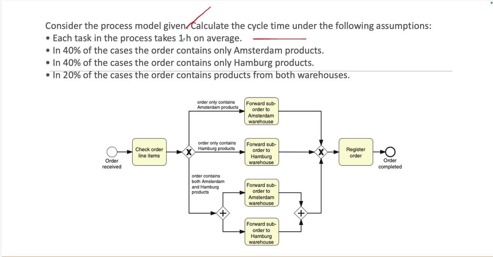

## Đề bài

### Nhánh 1 (40%) — chỉ có sản phẩm Amsterdam

Check order line items (1h) → Forward sub-order to Amsterdam warehouse (1h) → Register order (1h)

**Tổng: 1 + 1 + 1 = 3h**

### Nhánh 2 (40%) — chỉ có sản phẩm Hamburg

Check order line items (1h) → Forward sub-order to Hamburg warehouse (1h) → Register order (1h)

**Tổng: 1 + 1 + 1 = 3h**

### Nhánh 3 (20%) — có cả sản phẩm Amsterdam và Hamburg

Check order line items (1h) → AND-split → 2 task chạy **song song** (Forward to Amsterdam **và** Forward to Hamburg, mỗi task 1h) → AND-join → Register order (1h)

Vì 2 task này chạy song song (parallel gateway), thời gian chờ = max(1h, 1h) = **1h** (không cộng dồn)

**Tổng: 1 + 1 + 1 = 3h**

# Tính Cycle Time kỳ vọng (Expected Cycle Time)

$$CT = 0.4 \times 3h + 0.4 \times 3h + 0.2 \times 3h$$

$$CT = 1.2h + 1.2h + 0.6h = 3h$$
## Kết quả: **3 giờ**