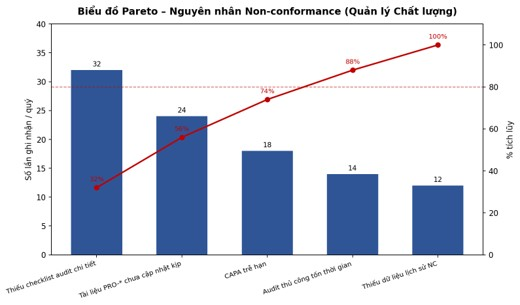

a) Phân tích giá trị gia tăng (VA / BVA / NVA)

Bảng phân loại hoạt động: Quản lý Danh mục Dự án & Phân bổ Nguồn lực (Project Portfolio & Resource Allocation Management)

|Liệt kê (bước)|Phân loại|Mô tả|Khắc phục|
|---|---|---|---|
|Thu thập nhu cầu nguồn lực|BVA|Tổng hợp yêu cầu nhân sự từ các PM|Chuẩn hóa mẫu yêu cầu, gửi qua hệ thống thay vì email|
|Đánh giá năng lực & % bận (thủ công trên Excel)|NVA|Tổng hợp thủ công từ nhiều file rời rạc|Dashboard utilization tập trung, cập nhật tự động|
|Ưu tiên hóa danh mục|BVA|Xếp hạng dự án theo giá trị hợp đồng và rủi ro|Áp dụng mô hình điểm số (scoring model) khách quan hơn|
|Phân bổ nhân sự|BVA|Gán nhân sự phù hợp vào từng dự án|Gợi ý phân bổ tự động dựa trên kỹ năng & lịch trống|
|Theo dõi utilization (thủ công)|NVA|Kiểm tra thủ công tiến độ sử dụng nguồn lực|Cảnh báo tự động khi utilization vượt ngưỡng|
|Họp điều chỉnh xung đột trực tiếp|NVA|Tốn thời gian họp lại nhiều lần khi có xung đột|Cảnh báo xung đột sớm trước khi xảy ra, giảm họp phát sinh|
|Escalate BOD khi đàm phán thất bại|BVA|Đưa quyết định lên cấp cao khi PM không tự giải quyết được|Quy trình escalation rõ ràng với tiêu chí cụ thể|

  

b) Phân tích lãng phí (Move / Hold / Overdo)

Bảng phân tích lãng phí: Quản lý Danh mục Dự án & Phân bổ Nguồn lực (Project Portfolio & Resource Allocation Management)

|Liệt kê|Mô tả|Khắc phục|
|---|---|---|
|Move|Yêu cầu nguồn lực được chuyển qua email nhiều vòng giữa PM – PMO – COO trước khi được duyệt.|Một cổng (portal) yêu cầu nguồn lực duy nhất, có luồng duyệt tự động.|
|Hold|Dự án phải chờ phân bổ nhân sự khi nguồn lực đang bận ở dự án khác.|Capacity planning dài hạn để dự báo trước nhu cầu nhân sự.|
|Overdo|PMO nhập lại thủ công dữ liệu utilization từ nhiều bảng tính riêng của từng PM.|Một nguồn dữ liệu utilization duy nhất, các PM cập nhật trực tiếp.|

c) Phân tích các bên liên quan và đăng ký phát hành

Bảng phân tích các bên liên quan: Quản lý Danh mục Dự án & Phân bổ Nguồn lực (Project Portfolio & Resource Allocation Management)

|Bên liên quan|Mối quan tâm chính|Rủi ro tiềm ẩn nếu quy trình không hiệu quả|
|---|---|---|
|PM (yêu cầu nguồn lực)|Có đủ nhân sự đúng kỹ năng, đúng hạn|Dự án trễ tiến độ nếu không được phân bổ kịp|
|PMO / Resource Manager|Cân đối nguồn lực hợp lý giữa các dự án|Quá tải khi nhiều yêu cầu xung đột cùng lúc|
|COO / BOD|Tối ưu hóa danh mục theo giá trị hợp đồng|Ra quyết định ưu tiên sai do thiếu dữ liệu chính xác|
|Khách hàng (dự án outsourcing)|Dự án được giao đúng hạn với nhân sự phù hợp|Mất niềm tin nếu dự án bị trễ do thiếu nhân sự|

  

Biểu đồ Pareto

Bảng đăng ký phát hành: Quản lý Danh mục Dự án & Phân bổ Nguồn lực (Project Portfolio & Resource Allocation Management)

|Tên vấn đề|Giả định|Tác động định tính|Tác động định lượng|Cải tiến|
|---|---|---|---|---|
|Xung đột phân bổ nhân sự|Nhiều dự án cùng cần nhân sự có kỹ năng hiếm|Dự án có thể bị trễ hoặc phải thỏa hiệp chất lượng|2–4 lần escalate lên BOD/tháng|Capacity planning dài hạn theo quý|
|Thiếu utilization real-time|Dữ liệu utilization nằm rời rạc trên Excel từng PM|PMO ra quyết định phân bổ dựa trên thông tin trễ|Dữ liệu utilization có độ trễ 2–3 ngày so với thực tế|Dashboard utilization tập trung, cập nhật tự động|
|Ưu tiên hóa danh mục thủ công|Ưu tiên dựa trên kinh nghiệm/áp lực deadline, thiếu mô hình điểm số|Quyết định ưu tiên có thể thiếu khách quan|Khó định lượng chính xác mức độ ưu tiên giữa các dự án|Áp dụng mô hình scoring (giá trị HĐ, rủi ro, deadline)|
|Chậm phản hồi khi thiếu hụt nguồn lực|Quy trình xử lý thiếu hụt qua nhiều bước duyệt tuần tự|Dự án chờ lâu mới có hướng xử lý (tuyển thêm/điều chỉnh)|Thời gian phản hồi trung bình 2–3 ngày, có thể lên 5–7 ngày|Quy trình phản hồi nhanh (fast-track) cho thiếu hụt khẩn cấp|
|Thiếu công cụ dự báo nhu cầu|Chưa có công cụ forecast nhu cầu nhân sự theo pipeline Sales|PMO bị động, chỉ xử lý khi yêu cầu phát sinh|Không dự báo được nhu cầu nhân sự trước 1–2 tháng|Tích hợp dữ liệu Sales pipeline vào công cụ dự báo nguồn lực|

  

Phân tích nguyên nhân gốc rễ (Root-Cause / Why-Why) cho từng vấn đề

1. Xung đột phân bổ nhân sự

➤ Vì: Nhiều dự án cùng yêu cầu nhân sự có kỹ năng hiếm cùng thời điểm

➤ Vì: Chưa có kế hoạch nguồn lực dài hạn (capacity planning)

➤ Vì: Tuyển dụng bổ sung không kịp theo tốc độ ký hợp đồng mới

➤ Vì: Thiếu công cụ theo dõi utilization real-time

➤ Vì: Dữ liệu phân tán trên Excel riêng của từng PM, chưa hợp nhất

➤ Vì: Chưa tích hợp giữa hệ thống HR và hệ thống quản lý dự án

2. Thiếu utilization real-time

➤ Vì: Dữ liệu phân tán trên Excel riêng từng PM

➤ Vì: Chưa tích hợp hệ thống quản lý dự án và HR

➤ Vì: Cập nhật thủ công, phụ thuộc PM báo cáo

➤ Vì: Chưa có quy định bắt buộc cập nhật hàng ngày

3. Ưu tiên hóa danh mục thủ công

➤ Vì: Chưa xây dựng mô hình tính điểm chính thức

➤ Vì: Thiếu dữ liệu chuẩn hóa về giá trị hợp đồng & rủi ro từng dự án

➤ Vì: Quyết định phụ thuộc kinh nghiệm cá nhân của COO/BOD

➤ Vì: Chưa có công cụ hỗ trợ ra quyết định (decision support tool)

4. Chậm phản hồi khi thiếu hụt nguồn lực

➤ Vì: Quy trình duyệt tuyển bổ sung/điều chỉnh qua nhiều cấp

➤ Vì: Chưa phân quyền xử lý nhanh cho trường hợp khẩn cấp

➤ Vì: Phối hợp giữa PMO và HR chưa chặt chẽ

➤ Vì: Thiếu kênh liên lạc trực tiếp, ưu tiên xử lý gấp

5. Thiếu công cụ dự báo nhu cầu

➤ Vì: Chưa liên kết dữ liệu Sales pipeline với kế hoạch nguồn lực

➤ Vì: Hai bộ phận Sales và PMO dùng hệ thống riêng biệt

➤ Vì: Chưa đầu tư công cụ forecast chuyên dụng

➤ Vì: Ưu tiên ngân sách công nghệ cho dự án khách hàng trước

  

d) Phân tích định lượng

Bảng các bước và thời gian xử lý: Quản lý Danh mục Dự án & Phân bổ Nguồn lực (Project Portfolio & Resource Allocation Management) (đơn vị: phút)

|STT|Bước|Thời gian (phút)|
|---|---|---|
|1|Thu thập yêu cầu nguồn lực|45|
|2|Đánh giá năng lực & % bận|60|
|3|Ưu tiên hóa danh mục (họp)|90|
|4|Phân bổ nhân sự|30|
|5|Theo dõi utilization|20|

Tổng thời gian xử lý cơ bản (90% trường hợp) = 45 + 60 + 90 + 30 + 20 = 245 phút.

Trường hợp phát sinh (10% trường hợp): thêm Họp điều chỉnh xung đột (60 phút) + escalate BOD (40 phút) = 100 phút → Tổng thời gian xử lý khi có phát sinh = 345 phút.

Thời gian xử lý trung bình = (90% × 245) + (10% × 345) = 255 phút.

Hiệu suất thời gian của quy trình = (Thời gian kế hoạch / Thời gian thực tế) × 100% = (270 / 255) × 100% = 105.9%.
  

Bảng phân bổ nguồn lực: Quản lý Danh mục Dự án & Phân bổ Nguồn lực (Project Portfolio & Resource Allocation Management)

| Giai đoạn                        | Nhân sự tham gia       | Bộ phận                        |
| -------------------------------- | ---------------------- | ------------------------------ |
| Thu thập & đánh giá yêu cầu      | PM, PMO                | Phòng Dự án, PMO               |
| Ưu tiên hóa danh mục             | COO/BOD, PMO           | Ban Giám đốc, PMO              |
| Phân bổ & theo dõi               | PMO                    | PMO                            |
| Điều chỉnh xung đột / escalation | PMO, PM, BOD (nếu cần) | PMO, Phòng Dự án, Ban Giám đốc |

Bảng phân tích định lượng: Quản lý Danh mục Dự án & Phân bổ Nguồn lực (Project Portfolio & Resource Allocation Management)

| Giải thích                                        | Giá trị ước lượng             | Gợi ý cải thiện                                     |
| ------------------------------------------------- | ----------------------------- | --------------------------------------------------- |
| Thời gian trung bình xử lý 1 yêu cầu nguồn lực    | 2 – 3 ngày                    | Portal yêu cầu tự động rút ngắn còn 1 ngày          |
| Tỷ lệ dự án bị trễ do thiếu nhân sự               | 10 – 15%                      | Capacity planning theo quý để dự báo sớm            |
| Tỷ lệ utilization trung bình toàn công ty         | 78 – 85%                      | Cân bằng lại phân bổ để tránh quá tải cục bộ        |
| Chi phí thuê ngoài (freelancer) khi thiếu hụt gấp | Ước tính 20–40 triệu đồng/quý | Xây dựng bench hợp lý (10–15%) để ứng phó thiếu hụt |
| Số lần escalate lên BOD/tháng                     | 2 – 4 lần                     | Áp dụng scoring model để giảm tranh chấp ưu tiên    |
| Hiệu suất thời gian quy trình (kế hoạch/thực tế)  | 105,9%                        | Duy trì bằng dashboard utilization tập trung        |

  
Kết luận

Quy trình phân bổ nguồn lực hiện mất trung bình khoảng 255 phút (~4 giờ 15 phút) mỗi chu kỳ xử lý yêu cầu, đạt hiệu suất thời gian 105,9% so với kế hoạch (270 phút). Tuy nhiên, chi phí thuê ngoài phát sinh khi thiếu hụt nhân sự gấp ước tính 20–40 triệu đồng/quý và tỷ lệ dự án bị trễ do thiếu nhân sự vẫn ở mức 10–15%. Nhóm đề xuất xây dựng capacity planning dài hạn và dashboard utilization tập trung để giảm xung đột phân bổ và chi phí phát sinh.
