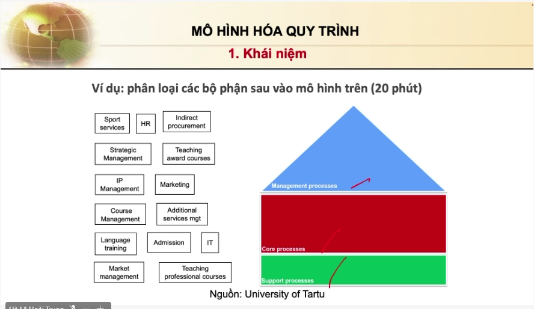

**Khái niệm**

**1. Core processes (Quy trình cốt lõi):** là các quy trình **tạo ra giá trị** vì chúng **gắn kết trực tiếp với khách hàng bên ngoài** (external customers). Đây là các hoạt động kinh doanh chính của tổ chức — ví dụ trong tài liệu: quy trình Fill Order (nhận đơn hàng → duyệt đơn → hoàn tất đơn → giao hàng).

**2. Management processes (Quy trình quản lý):** là các quy trình **cung cấp định hướng, quy tắc và thực tiễn quản lý** (direction, rules and practices) cho toàn bộ tổ chức. Chúng không tạo giá trị trực tiếp cho khách hàng mà điều phối, giám sát các quy trình khác — ví dụ: quy trình Plan Vendors (đánh giá nhà cung cấp, ký hợp đồng, thiết lập thủ tục nguồn cung).

**3. Support processes (Quy trình hỗ trợ):** là các quy trình **cung cấp nguồn lực** (resources) để các quy trình khác sử dụng. Chúng phục vụ nội bộ, đảm bảo core processes vận hành trơn tru — ví dụ: quy trình Reorder Supplies (đặt hàng vật tư, nhận và lưu kho vật tư).

Mối quan hệ giữa 3 lớp trong mô hình: Management processes ở trên cùng (điều hướng), Core processes ở giữa (kết nối Suppliers/Partners với Customers/Stakeholders), Support processes ở dưới cùng (cung cấp nguồn lực nâng đỡ toàn bộ hệ thống).

**Bài tập ví dụ:**

**🔵 Management processes (định hướng, quy tắc):**
- Strategic Management — hoạch định chiến lược, định hướng toàn trường
- Market management — quản lý/định hướng thị trường đào tạo
- IP Management — quản lý sở hữu trí tuệ, đặt ra quy tắc về tài sản trí tuệ

**🔴 Core processes (tạo giá trị trực tiếp cho khách hàng — sinh viên/học viên):**
- Teaching award courses — giảng dạy chương trình cấp bằng (sản phẩm chính)
- Teaching professional courses — giảng dạy các khóa chuyên môn/ngắn hạn
- Course Management — quản lý môn học, phục vụ trực tiếp việc đào tạo
- Admission — tuyển sinh, tiếp xúc trực tiếp với khách hàng tiềm năng
- Language training — đào tạo ngôn ngữ, dịch vụ trực tiếp cho học viên
- Marketing — thu hút sinh viên, gắn trực tiếp với khách hàng bên ngoài (tương tự kiến trúc quy trình trong chap01, Marketing được xếp vào Core)

**🟢 Support processes (cung cấp nguồn lực):**
- HR — nhân sự (giống ví dụ chap01: HR thuộc Support)
- IT — hạ tầng công nghệ (chap01 cũng xếp IT vào Support)
- Indirect procurement — mua sắm gián tiếp (chap01 xếp vào Support)
- Sport services — dịch vụ thể thao, tiện ích phục vụ nội bộ
- Additional services mgt — quản lý các dịch vụ bổ trợ